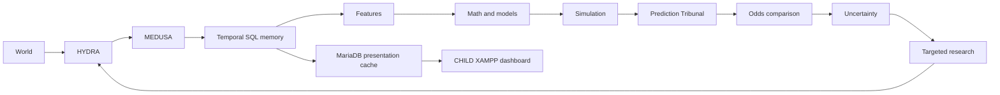

# DRAGONHYDRACHILD

**EXPERIMENTAL FULL-ROADMAP FORK · Python 3.14 · Private**

Independent experimental child of DRAGONHYDRA at donor commit `a773d9fe14313f0af3bef3f0aec89f3391d81fa6`. This project attempts the complete V0–V10 architecture in one owner-authorized mission. It does not supersede the parent and does not inherit its validation claims automatically.

The parent at `C:\xampp\DRAGONHYDRA` is read-only. CHILD work lives at `C:\xampp\DRAGONHYDRACHILD`, uses new Git history and isolated write resources. Historical inherited documentation is donor evidence; do not run donor-targeted commands from it.

Preserve provenance, temporal discipline, feedback-driven research and evaluation discipline. Future states are probability distributions, never observed facts. Completion pressure cannot turn synthetic or reconstructed evidence into real STRICT_PIT observations.

Read [experiment scope](README_CHILD_EXPERIMENT.md), [mission](docs/CHILD_MISSION.md), [execution status](docs/CHILD_EXECUTION_STATUS.md), [lineage](docs/CHILD_PARENT_LINEAGE.md), [donor proof](docs/PARENT_DONOR_PROVENANCE.md), the unchanged [master roadmap](docs/DRAGONHYDRA_MASTER_ROADMAP.md) and [cadence override](docs/DRAGONHYDRACHILD_EXECUTION_OVERRIDE.md). The [inherited README](README_PARENT.md) preserves the donor baseline.



The working experiment has independent SQL Server/MariaDB storage, two lawful public-source adapters, 22 feature outputs, seven forecasting methods, Poisson/Dixon–Coles/Monte Carlo simulations, model comparison, a bounded controlled research loop, and a genuine frozen prospective prediction. Windows and Ubuntu portable CI are separate from local database/GPU checks. [Measured results and limitations](docs/FINAL_DRAGONHYDRACHILD_REPORT.md) and the [version matrix](docs/CHILD_V0_V10_COMPLETION_MATRIX.md) distinguish completed experimental gates from blocked external validation.

Historical evaluation covers 321 matches from one **RECONSTRUCTED_PIT / DEMONSTRATION_ONLY** season. Real odds, actual prospective outcome scoring and real targeted-research benefit remain unproved. Thirteen logical HYDRA capabilities exist; only match/team/historical/weather currently have functioning acquisition paths. No stage status means production readiness.

The local [CHILD dashboard](http://localhost/joomla-codex-lab/dragonhydrachild/) shows evidence, timestamps, features, model disagreements, simulations, missing markets, research status and the immutable forecast reference. See [operations](docs/CHILD_OPERATIONS.md) for isolated provisioning, deployment, replay and scheduler controls. The daily Windows task runs only while its owner is signed in; disable it with `scripts\Manage-ChildScheduler.ps1 -Action Disable`.

Portable checks need Python 3.14 and no private infrastructure:

```powershell
Set-Location C:\xampp\DRAGONHYDRACHILD
python -B scripts/run_ci.py
```

On the configured CHILD laboratory, `python -B scripts/run_child_tests.py` adds applicable live checks; it deliberately does not run inherited donor-credential mutation tests. `python -B scripts/child_collect.py` executes the bounded acquisition, analysis, prediction/outcome and presentation cycle. Read the operations guide before provisioning. Do not run inherited donor provisioning scripts.

Runtime, secrets, raw source files and full checkpoints remain local. Only sanitized summaries belong in [docs/evidence](docs/evidence/README.md). Source code policy does not license external data. No automatic wagering, unrestricted scraping, guaranteed profit or production readiness is promised.
