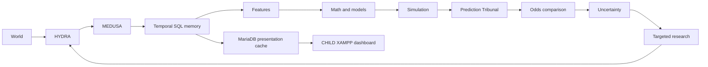

# DRAGONHYDRACHILD

**EXPERIMENTAL FULL-ROADMAP FORK · Python 3.14 · Private**

Independent experimental child of DRAGONHYDRA at donor commit `a773d9fe14313f0af3bef3f0aec89f3391d81fa6`. This project attempts the complete V0–V10 architecture in one owner-authorized mission. It does not supersede the parent and does not inherit its validation claims automatically.

The parent at `C:\xampp\DRAGONHYDRA` is read-only. CHILD work lives at `C:\xampp\DRAGONHYDRACHILD`, uses new Git history and isolated write resources. Historical inherited documentation is donor evidence; do not run donor-targeted commands from it.

Preserve provenance, temporal discipline, feedback-driven research and evaluation discipline. Future states are probability distributions, never observed facts. Completion pressure cannot turn synthetic or reconstructed evidence into real STRICT_PIT observations.

Read [experiment scope](README_CHILD_EXPERIMENT.md), [mission](docs/CHILD_MISSION.md), [execution status](docs/CHILD_EXECUTION_STATUS.md), [lineage](docs/CHILD_PARENT_LINEAGE.md), [donor proof](docs/PARENT_DONOR_PROVENANCE.md), the unchanged [master roadmap](docs/DRAGONHYDRA_MASTER_ROADMAP.md) and [cadence override](docs/DRAGONHYDRACHILD_EXECUTION_OVERRIDE.md). The [inherited README](README_PARENT.md) preserves the donor baseline.



Portable checks need Python 3.14 and no private infrastructure:

```powershell
Set-Location C:\xampp\DRAGONHYDRACHILD
python -B scripts/run_ci.py
```

Runtime, secrets, raw source files and full checkpoints remain local. Only sanitized summaries belong in [docs/evidence](docs/evidence/README.md). Source code policy does not license external data. No automatic wagering, unrestricted scraping, guaranteed profit or production readiness is promised.
