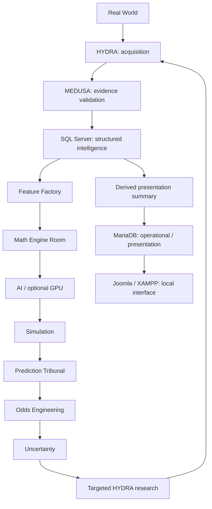

> Historical donor README. Its machine paths and commands describe DRAGONHYDRA, which is READ-ONLY during the CHILD experiment. Use the CHILD README for current operations.

# DRAGONHYDRA

**Experimental sports-intelligence laboratory · Python 3.14 · Private development repository**

DRAGONHYDRA builds an auditable path from external sports evidence to time-correct analysis. Its long-term goal is to detect uncertainty in its own analysis, research the missing information that could reduce it, validate new evidence and recalculate.

Three permanent laws govern the design: **provenance, temporal discipline and feedback-driven research**. Every important fact needs its origin; historical analysis must use only information available at the prediction time; research should eventually target measured information gaps.

The fourth practical law is **evaluation discipline**: predictive progress requires declared point-in-time, out-of-sample evaluation against simple baselines. [Scientific Validation Spine Phase A](docs/SCIENTIFIC_VALIDATION_SPINE.md) adds explicit temporal modes, canonical identities, empirical baselines and a prospective evidence clock while V1 remains active.

This is an evolving engineering laboratory, not production software. Current work is **V1: Web → Medusa → SQL → Joomla**. The [master roadmap](docs/DRAGONHYDRA_MASTER_ROADMAP.md) is long-term direction, not a single-session implementation order. Begin with **2–3 high-quality sources**, one sport and one league; normally implement **3–5 closely related roadmap items** per coherent session.

## Current maturity

| Capability | State and evidence |
| --- | --- |
| Python 3.14, temporal/evidence contracts, bounded database adapters, GPU correctness diagnostics | Implemented and locally tested; clean-machine infrastructure provisioning is not established |
| Public Web → validation → SQL → MariaDB → local dashboard | Implemented; 380 historical OpenFootball fixtures demonstrated in the [Web-to-SQL report](docs/WEB_SQL_FINAL_REPORT.md) |
| Desktop/CLI file bridge, hashing, append history, replay and receipts | Implemented; synthetic end-to-end demonstration in the [bridge report](docs/DESKTOP_CLI_BRIDGE_FINAL_REPORT.md) |
| Genuine rendered Desktop Browser → separate Codex CLI → dashboard | Experimental; successful real-browser proof remains pending |
| Scientific validation spine | Experimental: temporal modes, scoped identities, chronological empirical baselines and one genuine prospective snapshot; [evidence and limits](docs/SCIENTIFIC_VALIDATION_SPINE.md) |
| Feature Factory, competing models, simulations, prediction tribunal, targeted uncertainty research | Planned; contracts and synthetic odds helpers do not establish these systems |

See [current status](docs/ROADMAP_STATUS.md), [test tiers](docs/TESTING.md) and the [repository baseline report](docs/reports/GITHUB_BASELINE.md). Earlier milestone reports retain their original test counts and dates. **LOCAL FORENSIC EVIDENCE** stays in ignored `runtime/checkpoints`; **REPOSITORY-SAFE EVIDENCE** lives in [docs/evidence](docs/evidence/README.md) as small sanitized summaries with source hashes. Credentials, database files, raw logs and downloaded datasets are excluded from Git.

## Architecture

The diagram shows the intended intelligence loop. The implemented ingestion path is described above; downstream analytical stages remain planned.



| Component | Responsibility |
| --- | --- |
| HYDRA / MEDUSA | Acquire evidence / validate it; neither decides final match outcomes |
| SQL Server | Primary structured intelligence memory; append-oriented observations and provenance |
| MariaDB | Operational state and bounded presentation cache; no duplicate intelligence warehouse |
| DuckDB / Parquet | Future analytical memory and historical archives |
| Python 3.14 | Orchestration, contracts, validation, persistence and future calculations |
| PyTorch / CUDA | Optional accelerated compute where benchmarks justify it; local GPU diagnostic is a correctness proof |
| Joomla / XAMPP | Local human-facing interface; current custom endpoint does not modify Joomla core/content tables |
| Codex Desktop / Codex CLI | Browser/research surface / engineering and system surface, joined by explicit files |

See [Pyramid architecture](docs/PYRAMID_ARCHITECTURE.md), [database ownership](docs/DATABASE_ROLES.md) and [architecture decisions](docs/architecture/ADR_INDEX.md).

## Quick start

The portable development tier needs **Python 3.14**, Git and this checkout. It needs no database, GPU, XAMPP, secret, network data source or installed package dependency. In PowerShell:

```powershell
git clone https://github.com/chatgptopenaiagi/DRAGONHYDRA.git
Set-Location DRAGONHYDRA
python --version  # Must be 3.14.x
python scripts/run_ci.py
python scripts/repository_audit.py --help
```

Repository access requires authorization while visibility is private. CI tests code and synthetic fixtures; it does not run HYDRA collectors or provision infrastructure.

The existing Windows laboratory uses a configured Conda environment and local services. These are **local-machine-specific examples**, not a one-command installation for other machines:

```powershell
conda activate codex-pytorch
Set-Location C:\xampp\DRAGONHYDRA
$env:PYTHONPATH = Join-Path (Get-Location) 'src'
python -m dragonhydra diagnostics
.\scripts\Run-DualDatabase.ps1
```

The launcher defaults to the existing canonical `codex-pytorch` executable and accepts `-Python` for an explicitly configured Python 3.14 interpreter. Diagnostics require the configured NumPy/PyTorch/CUDA stack. The dual-database launcher runs live database capability checks, GPU diagnostics and the full local suite; use it only in the prepared lab. It does not provision credentials or restart services.

Local presentation: <http://localhost/joomla-codex-lab/dragonhydra/>. Prerequisites and commands are in [test tiers](docs/TESTING.md), [Python policy](docs/PYTHON314_POLICY.md), [database drivers](docs/PYTHON314_DATABASE_DRIVERS.md), [Web pipeline](docs/WEB_SQL_PIPELINE.md) and [Desktop handoff instructions](docs/CODEX_DESKTOP_HANDOFF_INSTRUCTIONS.md). Never run one-time provisioning scripts as routine tests.

## Roadmap status

| Version | Scope | Status |
| --- | --- | --- |
| V0 | Foundation | Largely implemented and locally validated |
| V1 | Web → Medusa → SQL → Joomla | Active; genuine Desktop proof pending |
| V2 | HYDRA source adapters | Planned; specialist competition coverage unproved |
| V3 | Feature Factory | Planned |
| V4 | Math Engine Room | Contracts exist; competing calculation engines planned |
| V5 | Simulation | Planned |
| V6 | Prediction Tribunal | Planned |
| V7 | Odds engineering | Synthetic helpers exist; real market-history gate unproved |
| V8 | Uncertainty-driven research | Planned |
| V9 | Continuous historical evaluation | Planned |
| V10 | Full multi-head HYDRA | Deferred until earlier stages earn expansion |

No completion percentage is claimed. [ROADMAP_STATUS](docs/ROADMAP_STATUS.md) separates demonstrated components from pending gates. The next action is to commission and verify daily prospective collection for the existing permitted league/source. Genuine Desktop success remains unverified and is not being retried in this scientific block. The SV0–SV6 scientific track constrains future modeling without replacing V0–V10.

## Security and data boundaries

Generated credentials belong in ACL-protected `runtime/secrets`, outside Git and the web root. Runtime databases, handoffs, downloads, logs, models and checkpoints are local/generated. Runtime database accounts use bounded object permissions; the web interface reads a derived cache. Browser handoffs are untrusted input, validated and hashed rather than executed. Existing local wildcard listeners and the explicit loopback SQL certificate-trust exception remain documented limitations, not certified perimeter isolation.

Source approval, data licensing and robots policy are separate checks. Consult the [public sports source matrix](research/PUBLIC_SPORT_SOURCE_MATRIX.md), [research policy](docs/RESEARCH_POLICY.md) and [data policy](docs/DATA_POLICY.md). The source-code policy does not license third-party sports data. There is no automated authentication, paywall, CAPTCHA or rate-limit bypass.

Read [SECURITY](SECURITY.md) before reporting vulnerabilities or sharing diagnostics. Read [CONTRIBUTING](CONTRIBUTING.md) before changing code, source policies, schemas or dependencies. Copyright remains with the owner under [LICENSE_POLICY](LICENSE_POLICY.md); no open-source license is implied.

## Limitations and non-goals

No guaranteed betting profit, perfect predictions, automatic wagering, unrestricted scraping, anonymous evasion, real-time global coverage, production readiness or regulatory compliance is promised. Historical kickoff timezones can be unknown; availability must not be backdated. Source trust histories, cross-provider entity reconciliation, model calibration and uncertainty-reduction benefits are not yet demonstrated. A synthetic browser fixture never counts as genuine Desktop evidence.

## Repository map

| Path | Purpose |
| --- | --- |
| `src/dragonhydra` | Typed domain, storage, ingestion, diagnostics and handoff implementation |
| `tests` / `scripts` | Portable and live checks, explicit local launchers and reviewed provisioning records |
| `config` | Nonsecret configuration and authoritative schemas; generated local settings excluded |
| `docs` | [Documentation index](docs/INDEX.md), decisions, roadmap and curated reports |
| `research` | Source-policy matrix and authored research; raw captures remain local |
| `web` | Local presentation source |
| `.github` | Conservative CI, security checks and lightweight issue/PR templates |
| `runtime`, `data`, `models` | Ignored local/generated storage |

Development uses `main`; risky coherent blocks may use `feature/<name>`. See [release strategy](docs/RELEASE_STRATEGY.md), [changelog](CHANGELOG.md) and [repository operations](docs/REPOSITORY_OPERATIONS.md). Before large changes, read [AGENTS](AGENTS.md), this README, the master roadmap, current status, [PROGRESS](docs/PROGRESS.md) and [DECISIONS](docs/DECISIONS.md).

HYDRA COLLECTS. MEDUSA QUESTIONS. THE PYRAMID CALCULATES. THE TRIBUNALS EVALUATE. UNCERTAINTY ASKS WHAT IS MISSING. HYDRA RETURNS TO THE WORLD.
