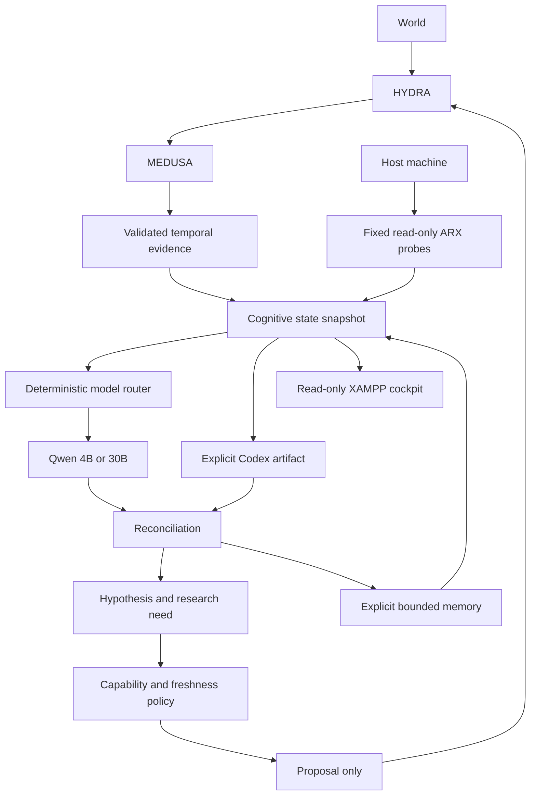

# Advanced cognitive awareness V2

DRAGONHYDRACHILD now has a bounded representation of its world, host machine, memory, models and permitted capabilities. Awareness means reconstructable operational state. It makes no claim of consciousness or autonomous Windows authority.

The feature branch starts at recovery commit `6c7c3ba401a7d103acbad2df3e173f5db2234b1d`. The parent, preserved LocalAI assets and original prospective forecast remain outside this change's write scope. Owner-authorized Ollama and manual llama endpoints are recognized as independent activity.



The diagram's proposal-to-HYDRA arrow is an existing controlled acquisition path, not a new automatic executor. AI interpretation cannot insert observations or MEDUSA acceptances. The model has no tools. Source text remains untrusted data and is omitted from model projections.

## Implemented layers

| Layer | Implementation and boundary |
| --- | --- |
| State | Typed immutable contracts; semantic state hash, clock-bearing artifact hash, explicit as-of cursor. |
| ARX | Fixed Windows probes, sanitized levels 0–2, hashed receipts, meaningful deltas and bounded event journal. |
| Memory | Working, episode, decision, learning and limitation records; append-only hash chain, reference checks, expiry and supersession. |
| Cognition | Explicit running-backend adapters; 4B reflex and 30B deeper-analysis policy; no automatic model process switching. |
| Codex | Independent actor consuming/exporting immutable artifacts; no private IPC. |
| Reconciliation | Same-state explicit position comparison; disagreement and missing evidence preserved; no linguistic averaging or truth winner. |
| Research | Falsifiable hypotheses and expected information value; unknown numeric benefit stays null. |
| Policy | Allow-listed proposals, current-state hash and freshness checks; all machine mutation descriptors disabled. |
| Feedback | Later observed evidence required; predictive gain requires observed outcome and comparable scores. |
| Cockpit | Fixed sanitized artifact, loopback reads, no service-control buttons. |

## Explicit engineering entry points

Use the repository's canonical Python 3.14 interpreter with `-B`:

```text
python -B scripts/cognitive_v2.py capture
python -B scripts/cognitive_v2.py cycle --task SUMMARIZE_STATE
python -B scripts/cognitive_v2.py export-codex --snapshot <artifact-sha256> --task TRIAGE_CHANGES
python -B scripts/cognitive_v2.py cycle --snapshot <artifact-sha256> --codex-result <actor-artifact-sha256>
```

The last command requires a still-fresh snapshot and an already-running matching gateway. A historical snapshot is available for explicit comparison, but cannot authorize a current proposal. Model launches remain separate trusted engineering operations through the preserved, restricted LocalAI launcher. No periodic cognitive daemon or new scheduled task is installed.

State is read from verified CHILD analysis content and the original prediction ledger. ARX observes repositories with Git optional locks disabled. An observation's age is never refreshed merely by loading it. Projection records explicitly count omitted facts; a bounded 4K model context is not the complete system.

See [contracts](COGNITIVE_STATE_CONTRACTS.md), [ARX](ARX_MACHINE_STATE_FABRIC.md), [memory](COGNITIVE_MEMORY.md), [routing](QWEN_ROUTING.md), [reconciliation](QWEN_CODEX_RECONCILIATION.md), [hypotheses](HYPOTHESIS_RESEARCH_ENGINE.md), [uncertainty](UNCERTAINTY_MAP.md), [security](COGNITIVE_SECURITY_MODEL.md), [cockpit](COGNITIVE_COCKPIT.md), [historical harvest](LOCALAI_GENETIC_HARVEST.md) and [validation progress](COGNITIVE_V2_PROGRESS.md).

HYDRA observes the world. ARX observes the machine. MEDUSA validates evidence. Memory preserves history. Math calculates. Qwen interprets. Codex challenges. Reconciliation compares. Uncertainty admits what is not known. Policy limits authority. The world returns the verdict. DRAGONHYDRA learns from the difference.
