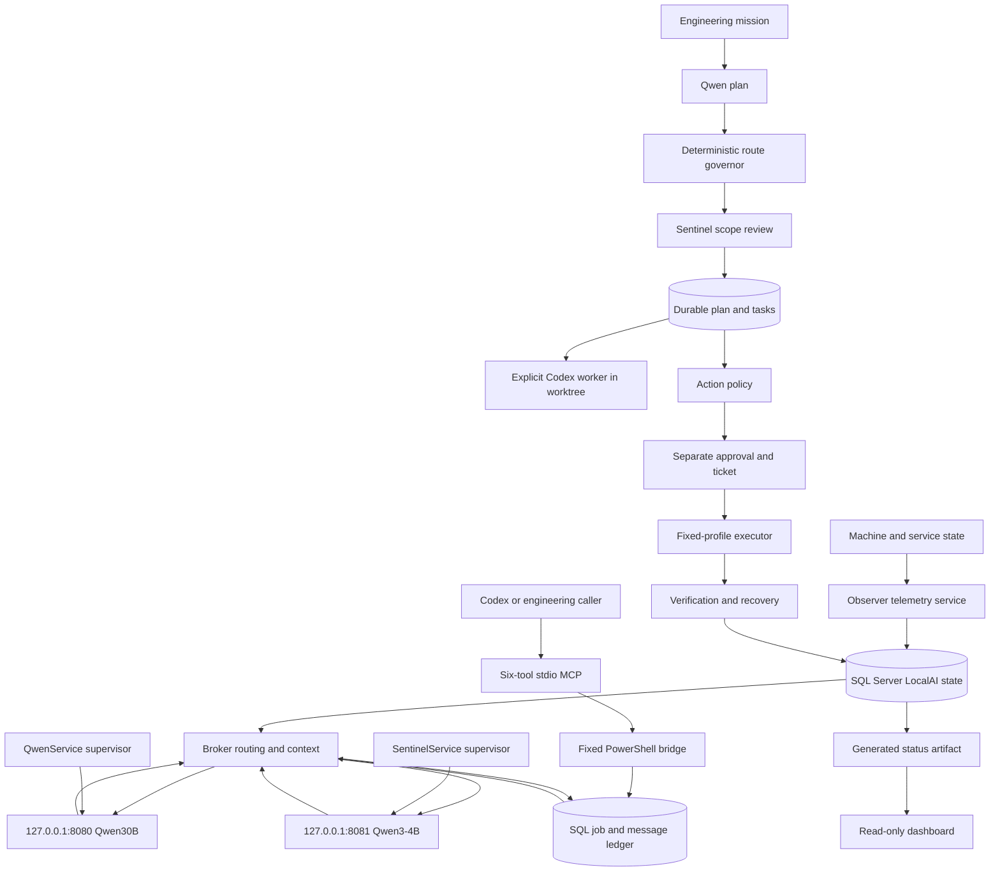

# Reconstructed LocalAI architecture

The surviving LocalAI system is a custom local engineering control plane with separate observation, inference, planning and action authorization. This reconstruction is evidence-backed and historical. It does not claim that the old services survived the Windows reinstall as installed services. Claim classifications follow [LocalAI archaeology](LOCALAI_ARCHAEOLOGY.md); machine-readable nodes, edges and uncertainties are in [the architecture map](evidence/localai_architecture_map.json).

## Historical component graph

**OBSERVED:** The source and configuration support these separate paths. Privileged execution is not on the inference path.



Graph references: `Broker/LocalAI.BrokerService.cs:100-171,200-330,498-552`; `Observer/LocalAI.ObserverService.cs:85-106,290-422`; `MCP/server.mjs:61-196`; `Tools/Invoke-LocalAIEngineeringPlanner.ps1:296-705`; `Productization/Docs/Architecture/ARCHITECTURE.md:9-25,45`. All source paths in this document are relative to `C:\LocalAI`.

## Components and dependencies

| Component | OBSERVED role / protocol | Historical identity and dependencies | Recovery disposition |
| --- | --- | --- | --- |
| QwenService | Windows `ServiceBase` supervisor: spawn fixed configured llama server, check `/health`, restart its child after threshold, write service/runtime logs. It is not the planner. | `LocalAI-Qwen30B`; historical `LocalSystem`; C# Windows service framework and native llama runtime. `Orchestrator/LocalAI.QwenService.cs:12,26,58-117,137-181,222-245`; Phase 2 receipt; Productization reboot preflight line 28. | Historical wrapper UNCHANGED / NOT_REQUIRED for minimal inference. Reuse model/runtime after validation. |
| Qwen30B inference | llama chat server on loopback HTTP 8080; context 8192, threads 10, batch 256, GPU layers 10, one slot. | Native DLLs plus model; no Python, SQL or MCP dependency in supervisor source. `config/qwen30b-service.conf:5-19`. | REUSED if current validation succeeds; resource profile must be measured. |
| SentinelService | Separate llama supervisor, not a process-inspection or action agent. Its 4B model is used for cheaper reasoning/review by callers. | `LocalAI-Sentinel`, historical service SID; HTTP 8081, context 4096, threads 4, batch 128, GPU layers 0, one slot. `Sentinel/LocalAI.SentinelService.cs:12,102-154`; `config/sentinel-service.conf:2-16`; Phase 4B receipt. | Wrapper UNCHANGED / NOT_REQUIRED. Model useful for first infrastructure test. |
| Observer | Samples CPU/RAM/disk/process count/GPU, configured service states and Qwen health. Writes samples, heartbeats and service changes to SQL; fallback JSONL on failure; retention cleanup. | `NT SERVICE\LocalAI-Observer`; SQL Server Windows integrated authentication; fixed `nvidia-smi`; Windows service/process APIs. `Observer/LocalAI.ObserverService.cs:85-106,158-177,223-280,290-478`; `config/observer.conf`. | UNCHANGED; full restoration DEFERRED. New recovery measurement is separate. |
| Broker | Claims queued SQL jobs atomically; explicit/heuristic target routing; constructs context from phase registry and latest telemetry; calls model; persists response/messages/status and heartbeat. | `NT SERVICE\LocalAI-Broker`; SQL Server `LocalAI`, `System.Data.SqlClient`, `System.Web.Script.Serialization`, HTTP. `Broker/LocalAI.BrokerService.cs:3,10,100-171,176-197,200-415`; Phase 5 receipt. | UNCHANGED; routing/audit concepts ADAPTED into strict minimal interface. Historical SQL is NOT_REQUIRED. |
| MCP | Six tool surface: status, snapshot, history, ask, job, recent jobs. Stdio to caller; starts one fixed PowerShell bridge, never accepts arbitrary script/SQL text as a tool. | Node; `@modelcontextprotocol/server` and client 2.0.0, Zod 4; PowerShell 7; SQL bridge. `MCP/server.mjs:1-25,61-196`; `MCP/package.json:7-10`; bridge parameter enum. | UNCHANGED / DEFERRED; optional future connector, not needed for CHILD HTTP adapter. |
| Engineering planner / governor | Qwen proposes bounded JSON plan, deterministic policy chooses route, Sentinel reviews scope, plan/task provenance persists. Route classes: deterministic, sentinel, qwen30b, codex. | PowerShell 7, SQL mission/plan/credit tables, bridge and models. `Tools/Invoke-LocalAIEngineeringPlanner.ps1:296-347,471-572,608-705`; `Tools/Resolve-LocalAIRoute.ps1:7-48`. | Concepts ADAPTED; no live mission execution enabled. |
| Codex workers | Curated context packet, optional local pre-analysis, explicit CLI process with read-only/workspace-write mode, task batches and isolated Git worktrees. | Node/CLI, Git, PowerShell, historical project roots. `Tools/Invoke-LocalAICodex.ps1:85-96,129-174`; `Tools/Get-LocalAICodexContext.ps1:121-134`; `ai machine.txt:324-348,399-416`. | DEFERRED; engineering Codex in recovery is separate from runtime orchestration. |
| Action / approval / recovery | Policy evaluation precedes separate approval, single-use ticket, fixed executor, terminal receipt, verification and fresh recovery authorization. | SQL ledger and dedicated executor tooling; later PrivilegedBroker service SID narrowly scoped to Observer restart. `Productization/Docs/Architecture/ARCHITECTURE.md:25,45`. | Preserved for security review; NOT_STARTED in recovery. |
| Dashboard | Renders a generated `public/status.json`, services, authority boundary and acceptance history. | Node/React/vinext; historical snapshot artifact. `Dashboard/app/page.tsx:1-3`; `Dashboard/package.json`. | Historical dashboard UNCHANGED; CHILD cockpit remains read-only and separate. |
| Python/SQLite agent | Earlier context builder, repository index, policy and receipts; direct chat HTTP bridge. | Python stdlib and `memory/memory.db`; `agent/context_builder.py:128-154`, `agent/llm_bridge.py:65-99`, `config/settings.json:6`. | UNCHANGED historical lineage; not prerequisite for native llama inference. |

**OBSERVED:** The historical durable database is SQL Server 2022, product version 16.0.1000.6, database `LocalAI`, configured loopback port 1433, Windows integrated authentication and 4096 MiB server memory (`config/sqlserver.json:5-14`). The service sources and MCP queries use this database. Historical PostgreSQL 18 tooling targets `LocalAI-PostgreSQL18` and port 5432 (`Tools/Test-LocalAIPostgreSQL.ps1:4-6`), but it is not called by the reviewed inference path. No MariaDB dependency appears in that path. This does not imply unrelated applications have no such dependencies.

**UNKNOWN:** Exact framework/compiler provenance for the four preserved service EXEs was not established by source inspection. The separate privileged broker build project targets .NET 10 (`Build/Phase10B-PrivilegedBroker-R2-20260831-130508/LocalAI.PrivilegedBroker.csproj:4`); that is not evidence that every older service uses the same runtime. No old executable was run to resolve this uncertainty.

## Request, context, response and authority

**OBSERVED:** Broker routing has two layers of historical policy. Its own `ResolveTarget` honors explicit model selection; otherwise prompts longer than 1200 characters or containing coding/architecture keywords select Qwen30B, with shorter remaining prompts selecting Sentinel (`Broker/LocalAI.BrokerService.cs:176-197`). Engineering routing is separate: deterministic status retrieval avoids a model; workspace writes or sufficient local failures can select Codex; other work is locally routed by the credit governor (`Tools/Resolve-LocalAIRoute.ps1:12-38`). Neither routing decision is proof of execution authorization.

**OBSERVED:** Broker context contains phase registry state, one latest telemetry sample, component descriptions and a security posture. It does not hand the model a SQL connection. Its prompt tells the model to acknowledge missing facts and not claim action execution without evidence (`Broker/LocalAI.BrokerService.cs:200-355`). The planner separately samples repository text with a 24,000-character total budget (`Tools/Invoke-LocalAIEngineeringPlanner.ps1:249-264`). Character limits did not guarantee token fit, as the preserved 9,554-token rejection demonstrates.

**OBSERVED:** The service wrappers can start/stop their own child process. That engineering supervision authority must not be confused with granting model output an execution capability. The Broker's inference path stores output text; it does not evaluate it as code. Later action machinery has separate records, policy and executor boundaries. The historical LocalSystem account of QwenService remains an unnecessary privilege risk for a newly bounded service, even though no model-output-to-shell path was found in that source.

**STRONGLY_INFERRED:** The useful recovered ancestor is the explicit boundary between measured machine state, local interpretation, authorization and measured action results. The model must remain an interpreter/planner/reviewer, not a source of external truth. A future ARX state fabric can reuse that separation while replacing old identity, freshness and schema assumptions.

## Minimal restoration design

**STRONGLY_INFERRED design decision:** The smallest sufficient subset preserves the old intent without replaying the whole installation:

```text
Controlled CHILD state
  -> deterministic sanitized snapshot
  -> allowlisted analysis task and request hash
  -> bounded localhost LocalAI interface
  -> identity-checked llama/Qwen endpoint
  -> strict structured response validation
  -> non-evidence cognitive result and audit receipt
  -> read-only cockpit / later Codex reconciliation
```

Native model inference is REUSED after integrity/compatibility tests. The request/response interface is REBUILT in CHILD because the old Broker depends on historical SQL and has weaker size/schema/failure handling. SQL Server, PostgreSQL, old service accounts, old DPAPI material, privileged recovery, Node MCP and the historical Python environment are NOT_REQUIRED for this minimal path. No old service is automatically installed or started.

**OBSERVED requirement:** Recovery must preserve original model/config/source bytes, separate the original frozen CHILD forecast from any new analysis, and leave parent DRAGONHYDRA unchanged. New runtime receipts belong in ignored CHILD runtime. Publicly tracked material consists of small sanitized source-backed summaries and tests. Current live readiness is reported in the recovery audit and runtime documentation; this architecture document does not promote historical health or proposed components into current operation.
